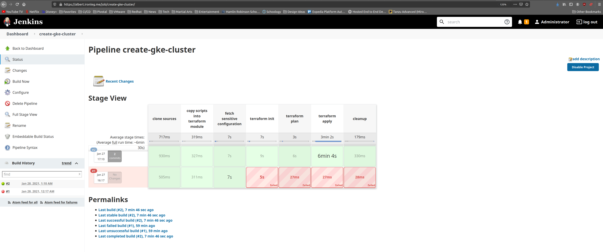

# docker-terraform-and-jenkins

Fun with Docker, Terraform, Jenkins and Artifactory.


## Prerequisites

* Google Cloud
  * [Service Account](https://cloud.google.com/iam/docs/creating-managing-service-accounts)
  * 2x [VMs](https://cloud.google.com/compute/docs/quickstart-linux)
    * 1 VM with Jenkins and Docker
    * 1 VM with Artifactory
  * 2x [Storage buckets](https://cloud.google.com/storage/docs/creating-buckets)
    * 1 should be named `terraform-state` and be configured to vend items only to authorized accounts
    * 1 should be named `sa-credentials` and be configured to vend items only to authorized accounts
* Jenkins
  * [Installation](https://www.cloudbooklet.com/how-to-install-jenkins-on-ubuntu-20-04-with-nginx-and-ssl/)
  * Add plugins
    * // TODO
  * Configure plugins
    * // TODO
* Docker
  * [Installation](https://linuxize.com/post/how-to-install-and-use-docker-on-ubuntu-20-04/)
  * Images
    * [cloud-sdk](https://cloud.google.com/sdk/docs/downloads-docker)
    * [terraform](https://hub.docker.com/r/hashicorp/terraform/)
* Artifactory
  * [Installation](https://computingforgeeks.com/configure-jfrog-artifactory-behind-nginx-reverse-proxy-letsencrypt/)
  * Configure a [local Generic repo](https://www.jfrog.com/confluence/display/JFROG/Repository+Management#RepositoryManagement-LocalRepositories) named `terraform-state`

## Setup for GKE

### Jenkins

Login to the Jenkins instance via your favorite browser

You'll need to create pipelines based upon [Jenkinsfile](https://www.jenkins.io/doc/book/pipeline/jenkinsfile/) you will find in the [ci](ci) directory.

// TODO

### Sensitive configuration

Upload your sensitive configuration to a pre-configured Google Cloud storage buckets.

To create each bucket you could use the [cloud-sdk](https://cloud.google.com/sdk/docs/downloads-docker) Docker image or have directly [installed the SDK on your workstation](https://cloud.google.com/sdk/docs/install). (It's strongly recommended to append a unique suffix to each bucket name to avoid name collisions/conflicts).

```bash
gsutil mb -l {location} gs://terraform-vars-{suffix}
gsutil mb -l {location} gs://sa-credentials-{suffix}
```
> Replace `{location}` above with a [region](https://cloud.google.com/about/locations) (e.g., `us-west1`).  Also replace `{suffix}` with a unique string.

Then configure buckets for version control

```bash
gsutil versioning set on gs://terraform-vars-{suffix}
gsutil versioning set on gs://sa-credentials-{suffix}
```
> Replace `{suffix}` above with same string you defined when you created the bucket

Now let's upload a couple files.  Place yourself into the module directory.

```bash
cd terraform/clusters/gke
```

#### terraform.tfvars

Copy the sample [terraform.tfvars.sample](terraform/clusters/gke/terraform.tfvars.sample) to `terraform.tfvars`. (Amend the value for each key in the new file as required and make sure that the end of this file contains a single newline).

Upload the file

```bash
gsutil cp terraform.tfvars gs://terraform-vars-{suffix}/clusters/gke/terraform.tfvars
```
> Replace `{suffix}` above with same string you defined when you created the bucket

#### backend.tf

Copy the sample [backend.tf.sample](terraform/clusters/gke/backend.tf.sample) to `backend.tf`. (Amend the value for each key in the new file as required).
> It's unfortunate that we can't use variables, see this [issue](https://github.com/hashicorp/terraform/issues/13022).

Upload the file

```bash
gsutil cp backend.tf gs://terraform-vars-{suffix}/clusters/gke/backend.tf
```
> Replace `{suffix}` above with same string you defined when you created the bucket

#### gcp-service-account.json

You'll need to upload a copy of the [service account key](https://cloud.google.com/iam/docs/creating-managing-service-account-keys#iam-service-account-keys-create-gcloud) (in json format).  The file should be named `gcp-service-account.json`.

```bash
gsutil cp gcp-service-account.json gs://sa-credentials-{suffix}/gcp-service-account.json
```
> Replace `{suffix}` above with same string you defined when you created the bucket