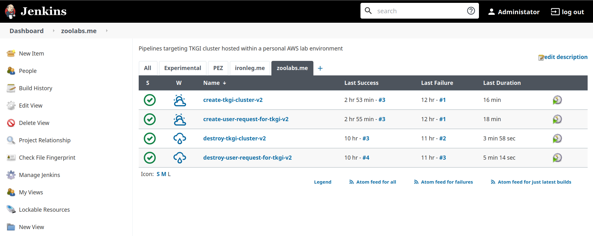

# docker-terraform-and-jenkins

Fun with Docker, Terraform, Jenkins and Artifactory.


## Prerequisites

* Google Cloud
  * [Service Account](https://cloud.google.com/iam/docs/creating-managing-service-accounts)
  * 2x [VMs](https://cloud.google.com/compute/docs/quickstart-linux)
    * 1 VM with Jenkins and Docker
    * 1 VM with Artifactory
  * 2x [Storage buckets](https://cloud.google.com/storage/docs/creating-buckets)
    * 1 should be named `terraform-state` and be configured to vend items only to authorized accounts
    * 1 should be named `sa-credentials` and be configured to vend items only to authorized accounts

* Jenkins
  * [Installation](https://www.cloudbooklet.com/how-to-install-jenkins-on-ubuntu-20-04-with-nginx-and-ssl/)
  * Add plugins (transitive dependencies not included for brevity)
    * [Amazon Elastic Container Service (ECS) / Fargate plugin](https://plugins.jenkins.io/amazon-ecs)
    * [Artifactory Plugin](https://plugins.jenkins.io/artifactory)
    * [Build Name and Description Setter](https://plugins.jenkins.io/build-name-setter)
    * [Build Timeout](https://plugins.jenkins.io/build-timeout)
    * [Command Agent Launcher Plugin](https://plugins.jenkins.io/command-launcher)
    * [Configuration as Code Plugin](https://plugins.jenkins.io/configuration-as-code)
    * [Docker Pipeline](https://plugins.jenkins.io/docker-workflow)
    * [Docker plugin](https://plugins.jenkins.io/docker-plugin)
    * [Docker Slaves Plugin](https://plugins.jenkins.io/docker-slaves)
    * [docker-build-step](https://plugins.jenkins.io/docker-build-step)
    * [Email Extension Plugin](https://plugins.jenkins.io/email-ext)
    * [Embeddable Status Plugin](https://plugins.jenkins.io/embeddable-build-status)
    * [Git Parameter Plug-In](https://plugins.jenkins.io/git-parameter)
    * [GitHub Branch Source Plugin](https://plugins.jenkins.io/github-branch-source)
    * [Google OAuth Credentials plugin](https://plugins.jenkins.io/google-oauth-plugin)
    * [Green Balls](https://plugins.jenkins.io/greenballs)
    * [JAXB Plugin](https://plugins.jenkins.io/jaxb)
    * [LDAP Plugin](https://plugins.jenkins.io/ldap)
    * [Matrix Authorization Strategy Plugin](https://plugins.jenkins.io/matrix-auth)
    * [Oracle SE Development Kit Installer Plugin](https://plugins.jenkins.io/jdk-tool)
    * [OWASP Markup Formatter Plugin](https://plugins.jenkins.io/antisamy-markup-formatter)
    * [PAM Authentication Plugin](https://plugins.jenkins.io/pam-auth)
    * [Pipeline](https://plugins.jenkins.io/workflow-aggregator)
    * [Pipeline Utility Steps](https://plugins.jenkins.io/pipeline-utility-steps)
    * [Pipeline: GitHub Groovy Libraries](https://plugins.jenkins.io/pipeline-github-lib)
    * [S3 publisher plugin](https://plugins.jenkins.io/s3)
    * [SSH Agent Plugin](https://plugins.jenkins.io/ssh-agent)
    * [SSH Server](https://plugins.jenkins.io/sshd)
    * [Terraform Plugin](https://plugins.jenkins.io/terraform)
    * [Timestamper](https://plugins.jenkins.io/timestamper)
    * [Windows Azure Storage plugin](https://plugins.jenkins.io/windows-azure-storage)
    * [Workspace Cleanup Plugin](https://plugins.jenkins.io/ws-cleanup)
  
* Docker
  * [Installation](https://linuxize.com/post/how-to-install-and-use-docker-on-ubuntu-20-04/)
  * Images
    * [cloud-sdk](https://cloud.google.com/sdk/docs/downloads-docker)
    * [terraform](https://hub.docker.com/r/hashicorp/terraform/)

* Artifactory
  * [Installation](https://computingforgeeks.com/configure-jfrog-artifactory-behind-nginx-reverse-proxy-letsencrypt/)
  * Configure a [local Generic repo](https://www.jfrog.com/confluence/display/JFROG/Repository+Management#RepositoryManagement-LocalRepositories) named `terraform-state`

* CLIs
  * [aws](https://docs.aws.amazon.com/cli/latest/userguide/install-cliv2.html)
  * GCP [cloud-sdk](https://cloud.google.com/sdk/docs/install)
  * [terraform](https://learn.hashicorp.com/tutorials/terraform/install-cli)

## Setup

We'll be managing Terraform *variables* and *secrets* in version-managed and encrypted cloud storage.  Terraform *state* will be managed in one of two ways, either within Artifactory or cloud storage.  For GCP we target Artifactory, while for AWS we target S3.

### Initialize buckets

**on AWS**

```bash
./bin/initialize-s3-buckets.sh {suffix}
```
> Replace `{suffix}` with a unique string.

**on GCP**

```bash
./bin/initialize-gs-buckets.sh {location} {suffix}
```
> Replace `{location}` above with a [region](https://cloud.google.com/about/locations) (e.g., `us-west1`).  Also replace `{suffix}` with a unique string.


## Working with Terraform modules

All Terraform modules employed by Jenkins pipeline definitions are found in the [terraform](terraform) directory.  Each module constitutes a unit of capability that will ultimately be assembled and then invoked by a chained list of pipeline jobs.  You'll implement modules in separate subdirectories.  Sample configuration should be maintained alongside implementation. 

Let's look at an example

> Assumes you have a Google Cloud Platform administrator account and an existing project

```bash
cd terraform/clusters/gke
```

Copy the sample [terraform.tfvars.sample](terraform/clusters/gke/terraform.tfvars.sample) to `terraform.tfvars`. (Amend the value for each key in the new file as required and make sure that the end of this file contains a single newline).

Copy the sample [backend.tf.sample](terraform/clusters/gke/backend.tf.sample) to `backend.tf`. (Amend the value for each key in the new file as required).
> It's unfortunate that we can't use variables, see this [issue](https://github.com/hashicorp/terraform/issues/13022).

Go! (Effectively smoke-testing).

```bash
terraform init
terraform plan -out terraform.plan
terraform apply -auto-approve terraform.plan
terraform output kubeconfig_contents > ~/.kube/config
```

Teardown!

```bash
terraform destroy -auto-approve
rm -Rf .terraform/ .terraform.lock.hcl terraform.log terraform.plan terraform.tfstate
```

## Jenkins pipeline workflow

Once you have authored and smoke-tested a module you'll want to invoke it from a Jenkins pipeline job.  Each module consumes variables and stores state in a backend provider.  Variables may contain sensitive configuration, and in some instances, configuration is owned or defined by different parties.  Therefore, it make sense to divide configuration supplied by a *user* and an *operator*.  Users will author and maintain configuration in a Git repository.  Operators will author and maintain sensitive configuration in either Artifactory or a version-managed, encrypted cloud storage bucket.

For examples of *user-supplied* configuration visit the [user](https://github.com/pacphi/docker-terraform-and-jenkins/tree/user) branch of this Git repository.

And here's an example of *operator-supplied* configuration

```yaml
cluster:
  api:
    url: "api.pks.hamster.zoolabs.me"
    skip_ssl_validation: true
    username: "tanzu-gitops"
    password: "why-would-i-share-this-with-you"

terraform:
  backend:
    type: "s3"
    bucket: "terraform-state-21665ca"
    region: "us-west-2"
  buckets:
    vars:
      name: "terraform-vars-21665ca"
    secrets:
      name: "terraform-secrets-21665ca"
```

### Upload operator manifest

**on AWS**

```bash
./bin/upload-operator-manifest-to-s3-buckets.sh {path-to-manifest} {s3-bucket-name} {environment} {manifest-filename}
```

Sample

```bash
./bin/upload-operator-manifest-to-s3-bucket.sh ../dev terraform-secrets-21665ca dev tkgi-cr.v1.yaml
```

**on GCP**

```bash
./bin/upload-operator-manifest-to-gs-buckets.sh {path-to-manifest} {gs-bucket-name} {environment} {manifest-filename}
```

Sample

```bash
./bin/upload-operator-manifest-to-gs-bucket.sh ../test terraform-secrets-076f328 test gke-cr.v1.yaml
```
### Service accounts 

**on GCP**

You'll need to upload a copy of the [service account key](https://cloud.google.com/iam/docs/creating-managing-service-account-keys#iam-service-account-keys-create-gcloud) (in json format).  The file should be named `gcp-service-account.json`.

```bash
gsutil cp gcp-service-account.json gs://sa-credentials-{suffix}/gcp-service-account.json
```
> Replace `{suffix}` above with same string you defined when you created the bucket


### Author Jenkinsfile 

You'll need to create some [pipelines](https://www.jenkins.io/doc/book/pipeline/jenkinsfile/) now.

For inspiration have a look in the [ci/gke](ci/gke) and [ci/tkgi](ci/tkgi) directories.

### Upload Jenkinsfile

Login to the Jenkins instance via your favorite browser.

Click on *New Item*.

*Enter an item name* then select *Pipeline* and click the *OK* button.

Scroll down to the *Pipeline* section.  Under the *Definition* sub-section make sure that *Pipeline script* is selected from the drop-down selector, then 
copy-and-paste the contents of a *Jenkinsfile* into the *Script* block.  Click the *Save* button to complete uploading the *Jenkinsfle*.

You might choose to organize related pipelines into a view.



> The collection of `-v2` suffixed pipelines you see in the screenshot above are based upon the `Jenkinsfile` pipelines found in the `ecs` sub-directories underneath the `ci/tkgi` sub-directory tree.

## Additional reading

* [Running Jenkins jobs in AWS ECS with salve agents](https://tomgregory.com/jenkins-jobs-in-aws-ecs-with-slave-agents/)
