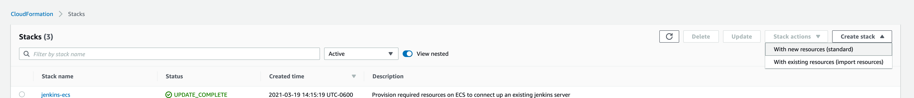
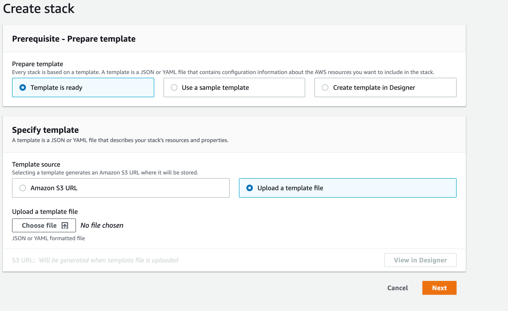
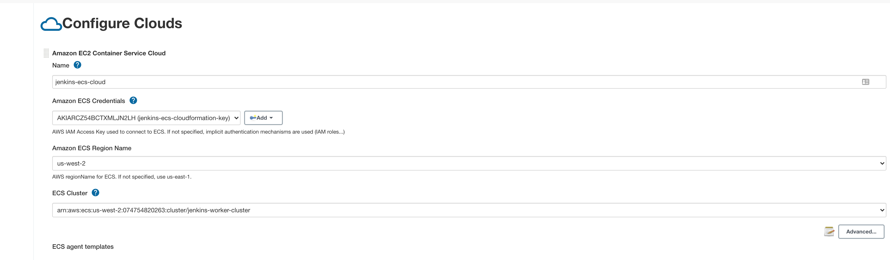
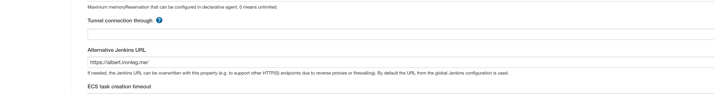
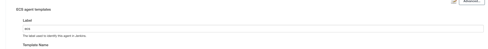
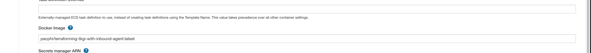
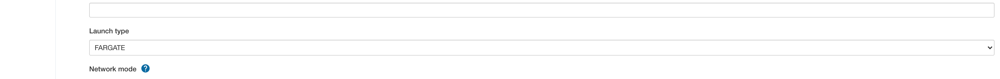
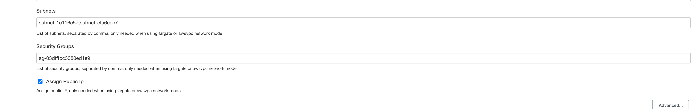

# Configure ECS Fargate as Jenkins Workers

This will walk through configuring ECS Fargate as on demand worker nodes for use with an existing jenkins server. 

## Prereqs

* AWS account with a default VPC setup
* Jenkins server with [ECS cloud plugin](https://plugins.jenkins.io/amazon-ecs/)
* Docker image that contains your tools and the jenkins inbound agent

## Deploy Required AWS resources

The included `ecs-agents.yml` file is a cloudformation template that will create all of the necessary reources in your AWS account. You can upload this file via the cloudformation GUI or using the CLI. 

1. create a new stack with new resources 

2. choose upload template file and upload the `ecs-agent.yml` and click next

3. Give a stack name and click next
4. No stack options are needed, click next
5. review and deploy.
6. in the stack outputs there will be an access key, secrete, key and security group id that can be used in the coming steps.

## Configure Jenkins

This will walk through configuring the Jenkins ECS cloud plugin to connect to our newly created ECS cluster.

1. create a jenkins credential with the CloudFormation output access and secret key

### Configuration as code

 1. If you are configuring jenkins with [configuration as code](https://www.jenkins.io/projects/jcasc/), then you can leverage the included `jenkins-cloud.yml` and append this into your configuration. you will need to modify the following fields. 
    
    * `cluster` - the arn of the ecs cluster
    * `jenkinsUrl` - the fqdn url that jenkins lives on
    * `credentialsId` - jenkins credentials id to connect to ECS. this is the credential ID created above
    * `securityGroups` - this will be the security group id from the CloudFormation output
    * `subnets` -  2 plulic subnets comma separated from your VPC.
    * `image` - the docker image you built above

### UI based config

1. navigate to `Manage Jenkins -> Nodes and Clouds -> configure clouds`
2. add a new cloud for ECS
3. update the first section with the required info, 
   * name
   * ECS credentials created above
   * region
   * select the ECS cluster from the dropdown

4. in the `advanced` section of the first block update the jenkins URL
   
   

5. in the `ECS Agent Templates` section update the label you want to use for jenkins workers

6. update the docker image you want to use that includes the inbound agent

7. set launch type to fargate

8. set the security group, subnets, and public ip fields

9. save and apply

## Test the agent

jump over to [this section](README.md#author-jenkinsfile) of the repo to deploy a sample pipeline and be sure to use the label you defined above for the worker.

